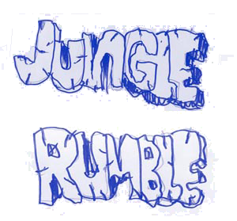
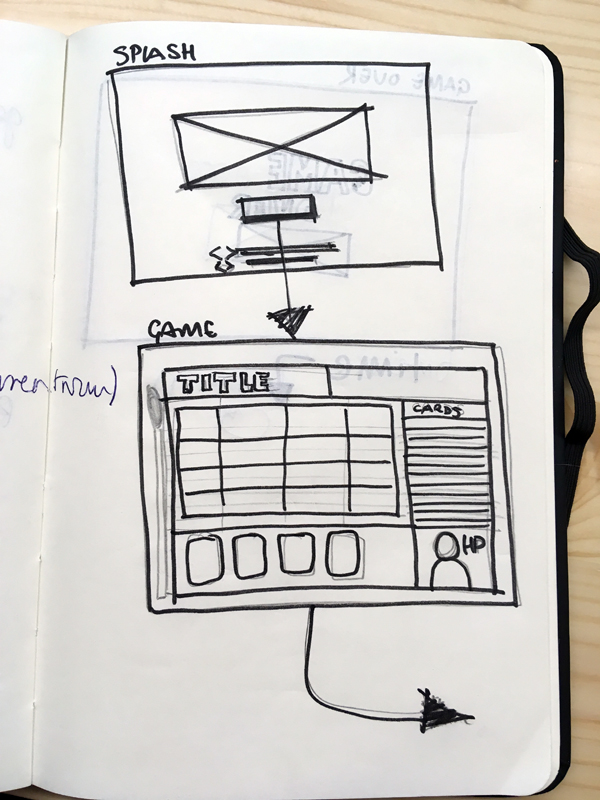
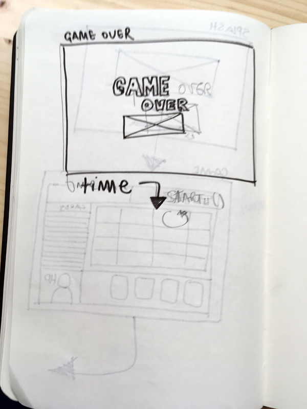

Rumble Jungle - Card Adventure


## Description
Rumble Jungle is a digital adventure where the a explorer makes their way thought the jungle.

The player has 16 cards from the stack. The cards are given in hands of 4. Once the cards are given, their front face is no more visible, so **it's up to the good venture to choose the right card!**

Every hand is played until 1 card remains in the hand. Then, the remaining card is discarded, and a new hand is sorted from the stack.

Each card represents an action in the journey. This actions can be a fight, eat, get killed by a perill.

The player wins the game when all the cards are played.
The player looses when their HP is 0 or they get suddenly killed by a perill.

In the user interface, the story will be watched card by card in a grid. Every cell is a small interactive movie.

## User Interface



### Spash Screen
* Opening shot
* Start button
* link or whatever credits

### Game Screen
* Title
* Adventure Grid
* Cards Stack List
* Active Card Slot section [4]
* HP monitor with portrait of the explorer

### Game Over Screen
* Game Over Text
* Picture of death snapshot (skull)


## MVP (DOM)
The mvp is a game where the player can select 3 card types and die or finish the quest. The quest view, Avatar UI, card stack and card slots are updated every game step. Basic animations on quest view are triggered.


## Backlog
- Card Animations on click [css]
- Stack card animations when giving the hand
- Backgrounds for cells [4 spr]
- Randomize backgrounds for cells
- player fight animation [4 spr]
- enemy fight animation [4 spr]
- more enemy fight animation [4 spr]
- Randomize animations (player and enemies)
- Animations for Avatar UI due HP level [4 spr]
- Jingle on starting the game
- background music
- Sfx Start button
- jingle on death
- jingle on win
- Sfx pick cards
- Sfx Hand 
- Sfx Fight
- Sfx killed by perill
- Sfx life++
- Sfx + Animations tribe playing congas


## Data structure
#####main.js

```
main(){
new player();
new cards();
new game();

buildDome();
buildSplashScren();
buildGameScreen();
buildGameOverScreen();
updateStackView(cardsStack);
updateHandSlotView(hand);
updateMonitorView(card.type);
updateAvatarView(hp);
}

window.addEventListener('load', main);

##### Game.js
Game(player,cardStack){
this.player = player;
this.cardStack = cardStack;
this.hand = [];
this.disposal =[];
}

Game.prototype.shuffle(cardStack){
return shuffledCards
}

Game.prototype.giveHand(cardStack){
return hand
}
Game.prototype.pickCardFromSlot(event){
checkCard();
}

Game.prototype.checkCard(card){
checkStatus();
displayStatus();
}

Game.prototype.fight(){
}

Game.prototype.hole(){
}

Game.prototype.life(){
}

Game.prototype.checkStatus(){
}

Game.prototype.flush(){
}

##### data.js
Cardstack =[…cards];


##### player.js
Player (){
this.hp = 10;
}

##### hand.js 
Hand(){
this.hand = [4]
}

##### card.js
Card(type){
this.type = type;
}


```


## States y States Transitions
```
- splashScreen()
	- buildDome();
	- buildGameScreen();

- starGame()
	-	new player();
	- new cards();
	- new game();
	
	- buildGameOverScreen()  

- gameOver() 
	- buildSplashScren();
```